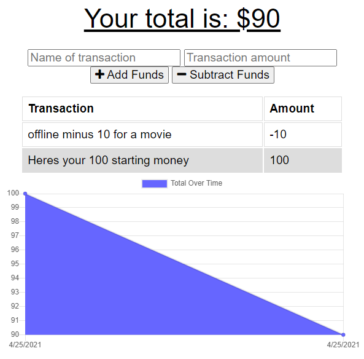

# mobile-budget

## License

## Table of Contents

 * [Installation](#installation)
 * [Usage](#usage)
 * [Credits](#credits)
 * [License](#license)
 
## Description
 
 [[CLICK ME TO GO TO THE APP](https://guarded-stream-98230.herokuapp.com/)]
 
Allows a Traveler to keep track of their budget in areas with poor internet connection.

## Usage

online/offline like an app.

## Installation

>express, mongoose, morgan, compression, heroku

## Languages

JavaScript , HTML , CSS , Node 

## Questions

https://github.com/AdamR-Work/mobile-budget

## Contributing

## Tests

>none

## Credits

